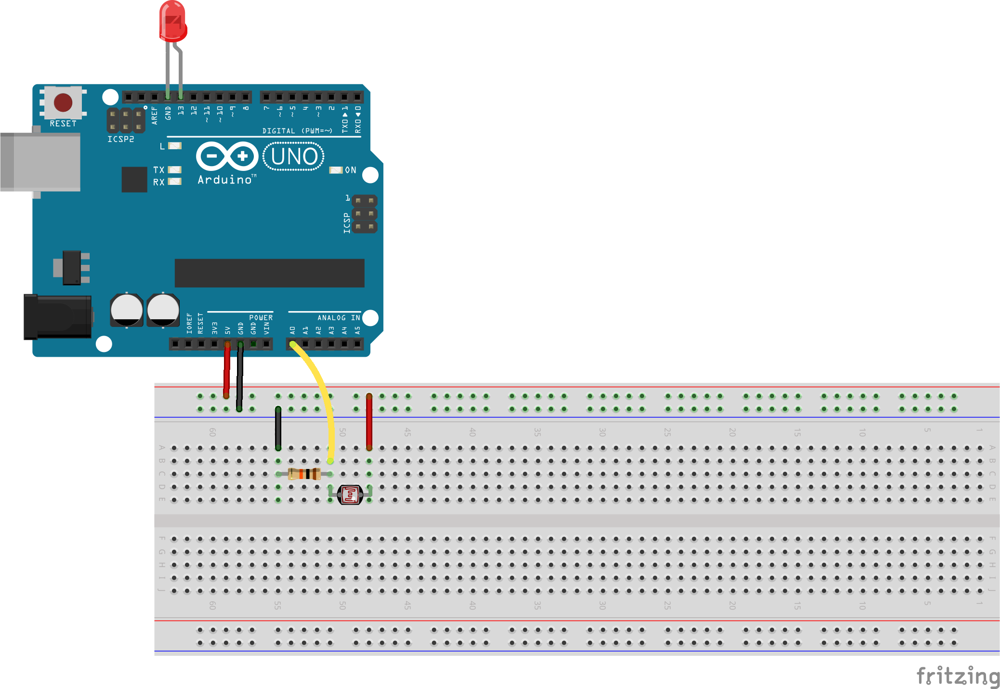
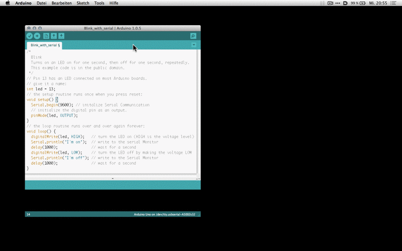
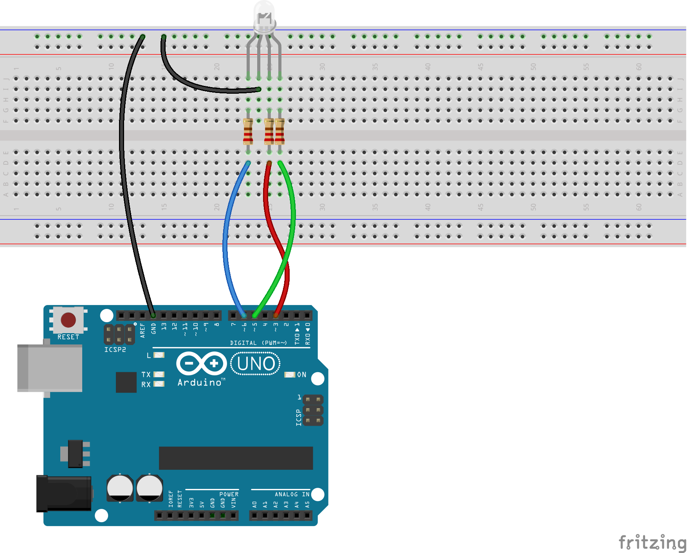

c2c
===

A collection of sketches for teaching computer to computer communication [@FH-Potsdam](https://github.com/FH-Potsdam).
These sketches are part of the course ["Input Output (Eingabe Ausgabe)Fundamentals of process-oriented design."](https://interface.fh-potsdam.de/eingabe-ausgabe/)  

##Needed Komponents  

- Computer  
- Arduino (Uno)  
- Arduino IDE  
- Processing IDE  
- Light Dependend Resistor  
- LED  
- RGB LED  
- 10k Ohm Resistor  
- 3 * 220 Ohm Resistor  
- Breadboard  
- Some wires  

###00 Serial Ports And Fritzing  
####prerequisites  
Set up your Arduino with a LDR (light dependend resistor) and the LED like this.  
  

- One LDR leg goes to the 5V pin 
- one LDR leg to the analog 0 pin
- connect the 10k Ohm resistor to the analog 0 pin as well
- connect the other leg of the resitor to the GND pin
- connect the long leg of the LED to the 13 digital pin
- connect the short leg to the GND pin

####Port Detection  
Connect your Arduino Board to your computer adn use the sketck [00_Serial-Ports-And-Fritzing/list_serial_ports/list_serial_ports.pde](00_Serial-Ports-And-Fritzing/list_serial_ports/list_serial_ports.pde) to see which port number is the one you choose in the Arduino IDE.  
**Yo need to modify all the .pde sketches to select the right serial port**  

###01 Arduino 2 Processing  

- Open and run the Processing sketch: 01_Arduino-2-Processing/pde/pde.pde  
- Open and upload the Arduino sketch: 01_Arduino-2-Processing/ino/ino.ino   

by waving your hand over the LDR you should be able to change the background color of the processing sketch.  

###02 Processing 2 Arduino

- Open and run the Processing sketch: 02_Processing-2-Arduino/pde/pde.pde  
- Open and upload the Arduino sketch: 02_Processing-2-Arduino/ino/ino.ino   

pressing UP and DOWN on your keyboard you can turn on a LED connected to pin 13  

###03 Poor Mans Oscilloscope

- Open and run the Processing sketch: 03_Poor-Mans-Oscilloscope/pde/pde.pde  
- Open and upload the Arduino sketch: 03_Poor-Mans-Oscilloscope/ino/ino.ino   

  

By waving your hand over the LDR you should be able to change the line.
The sketches written by [@chrismeyersfsu](https://gist.github.com/chrismeyersfsu/3270358) with edits from [@positron96](https://gist.github.com/positron96/7269466).  

###04 Round Trip

- Open and run the Processing sketch: 04_Round-Trip/pde/pde.pde  
- Open and upload the Arduino sketch: 04_Round-Trip/ino/ino.ino  

  

watch what happens in the serial monitor and the processing console. Messages are passed around...

###05 Processing 2 Arduino Motion Detection

- Open and run the Processing sketch: 05_Processing-2-Arduino-Motion-Detection/pde/pde.pde  
- Open and upload the Arduino sketch: 05_Processing-2-Arduino-Motion-Detection/ino/ino.ino  

by using the build in cam of our laptop or an webcam you can blink an LED by just moving infront of the camera.  

###06 Processing 2 Arduino Multiple Values

- Make a new arduino setup like this image  

  

- Open and run the Processing sketch: 06_Processing-2-Arduino-Multiple-Values/pde/pde.pde  
- Open and upload the Arduino sketch: 06_Processing-2-Arduino-Multiple-Values/ino/ino.ino  

You can set the color of the RGB-LED from Processing.

##License  
If not further noted 

This is free and unencumbered software released into the public domain.  

Anyone is free to copy, modify, publish, use, compile, sell, or distribute this software, either in source code form or as a compiled binary, for any purpose, commercial or non-commercial, and by any means.  

In jurisdictions that recognize copyright laws, the author or authors of this software dedicate any and all copyright interest in the software to the public domain. We make this dedication for the benefit of the public at large and to the detriment of our heirs and successors. We intend this dedication to be an overt act of relinquishment in perpetuity of all present and future rights to this software under copyright law.  

THE SOFTWARE IS PROVIDED "AS IS", WITHOUT WARRANTY OF ANY KIND, EXPRESS OR IMPLIED, INCLUDING BUT NOT LIMITED TO THE WARRANTIES OF MERCHANTABILITY, FITNESS FOR A PARTICULAR PURPOSE AND NONINFRINGEMENT. IN NO EVENT SHALL THE AUTHORS BE LIABLE FOR ANY CLAIM, DAMAGES OR OTHER LIABILITY, WHETHER IN AN ACTION OF CONTRACT, TORT OR OTHERWISE, ARISING FROM, OUT OF OR IN CONNECTION WITH THE SOFTWARE OR THE USE OR OTHER DEALINGS IN THE SOFTWARE.  

For more information, please refer to <http://unlicense.org>  

##Poor mans ocilloscope
is under GNU General Public License  

(c) 2008 Sofian Audry (info@sofianaudry.com)  
This program is free software: you can redistribute it and/or modify
it under the terms of the GNU General Public License as published by
the Free Software Foundation, either version 3 of the License, or
(at your option) any later version.  

This program is distributed in the hope that it will be useful,
but WITHOUT ANY WARRANTY; without even the implied warranty of
MERCHANTABILITY or FITNESS FOR A PARTICULAR PURPOSE.  See the
GNU General Public License for more details.  

You should have received a copy of the GNU General Public License  
along with this program.  If not, see <http://www.gnu.org/licenses/>.  

